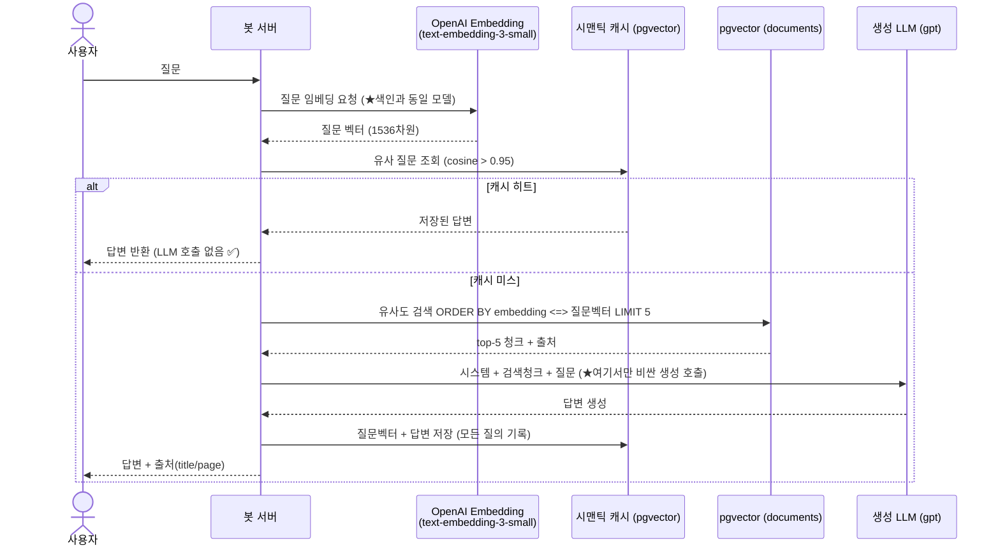
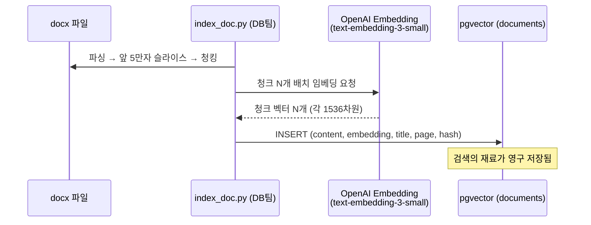

# ragbot-server

사내 API·도메인 지식을 **RAG**로 검색해 **Slack**에서 답하는 사내 LLM 챗봇의 **봇 서버**입니다.
별도 채팅 UI 없이 Slack을 프론트로 사용하며, 본 레포는 검색·생성·캐시를 오케스트레이션하는
**Spring AI 기반 봇 서버**(서버팀)만 다룹니다. 문서 색인/적재는 DB팀이 담당합니다.

> 상세 설계는 [`CLAUDE.md`](./CLAUDE.md), 단계별 개발 계획은 [`plan.md`](./plan.md) 참고.

## 핵심 목표
- **토큰 낭비 방지** — 시맨틱 캐시 히트·검색 실패 시 LLM 호출을 앞단에서 차단
- **환각(거짓말) 방지** — 검색된 근거(top-k 청크)에 기반해서만 답하고 **출처(title/page)** 표기

## 동작 흐름 (질의)



> 질문 임베딩은 **요청당 1회만** 계산해 캐시 조회·문서 검색에 재사용하고,
> 비싼 LLM 생성 호출은 **캐시 미스 + 검색 성공 경로에서만** 발생합니다.

## 색인 흐름 (문서 적재 · DB팀)



> ⚠️ **색인·질의 임베딩은 동일 모델(`text-embedding-3-small`, 1536차원)** 이어야 검색이 유효합니다.

## 기술 스택
- Java 21 · Spring Boot 3.x · **Spring AI 1.0.x** · Gradle
- OpenAI (Chat: gpt, Embedding: text-embedding-3-small)
- PostgreSQL + **pgvector** (cosine / HNSW)
- Slack Bolt (Socket Mode 우선)

## 프로젝트 구조 (요약)
```
slack/         Slack 인그레스 · 응답 게시
orchestration/ ChatOrchestrator (질의 파이프라인 단일 진입점)
embedding/     질문 임베딩 (1회 계산 후 재사용)
retrieval/     documents top-k 검색 + 출처
cache/         시맨틱 캐시 조회/저장
llm/           ChatClient · 프롬프트
guardrail/     입력 검증 · 레이트리밋
api/           /api/chat (테스트), /actuator
```

## 설정 / 실행
- 시크릿은 환경변수로 주입: `OPENAI_API_KEY`, `SLACK_BOT_TOKEN`, `SLACK_APP_TOKEN`, DB 접속정보
- 튜닝 값(모델·top-k·유사도 임계값·테이블명 등)은 `application.yml` 한 곳에서 관리

```bash
./gradlew bootRun        # 로컬 실행 (예정)
./gradlew test           # 테스트 (예정)
```

## 사용법
_(추후 추가 예정 — Slack 멘션/슬래시커맨드 사용법, 배포 절차 등)_

## 문서
- [`CLAUDE.md`](./CLAUDE.md) — 설계·규약·계약
- [`plan.md`](./plan.md) — Phase별 개발 계획
