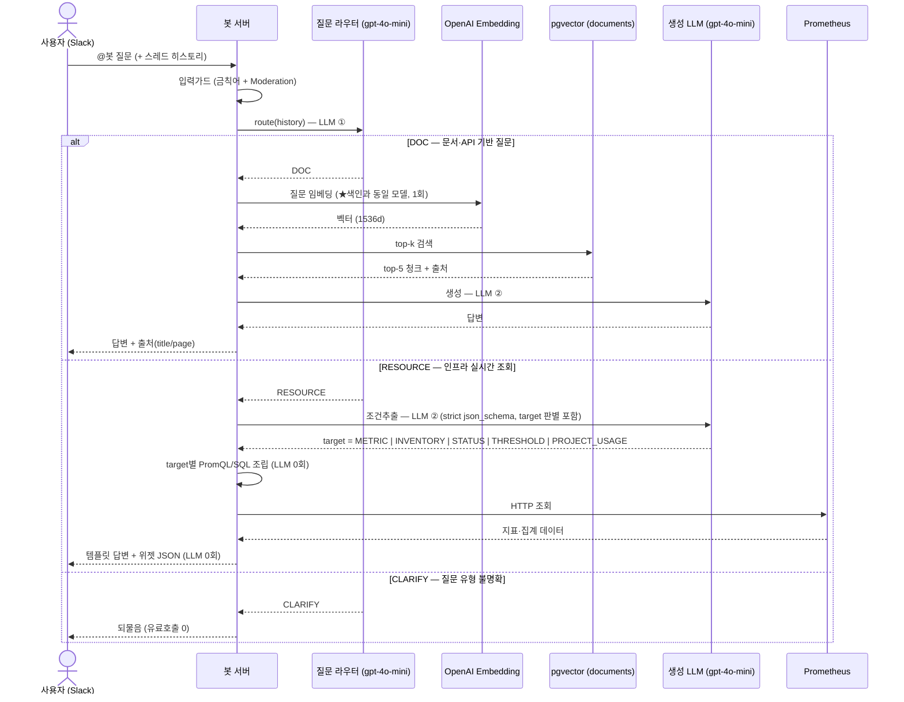

# ragbot-server

사내 API·도메인 지식을 **RAG**로 검색하고 인프라 실시간 지표를 **Prometheus**에서 조회해
**Slack**에서 답하는 사내 LLM 챗봇의 **봇 서버**입니다.

별도 UI 없이 Slack을 프론트로 쓰며, 본 레포는 검색·생성을 오케스트레이션하는 **Spring AI
기반 봇 서버**만 다룹니다. **이 봇 서버가 곧 "RAG 챗봇 서버"** — 별도 RAG 서버를 두지 않습니다.
문서 색인(임베딩해 적재)은 별도(색인 레포)가 담당하며, 이 앱은 `documents`를 **읽기만** 합니다.

> **임베딩은 OpenAI API 호출**입니다(로컬 모델 아님). `text-embedding-3-small`은 OpenAI 독점이라
> 로컬 구동이 불가하며, 색인·질의 임베딩 모두 OpenAI를 HTTP로 호출합니다.

## 핵심 목표

- **토큰 낭비 방지** — 검색 실패·유해 입력 시 LLM 호출을 앞단에서 차단 (캐시 히트 차단은 고도화)
- **환각 방지** — 검색 근거(top-k 청크)에 기반해서만 답하고 **출처(title/page)** 표기
- **실시간 인프라 지표** — Prometheus PromQL 조회로 CPU·메모리·네트워크·디스크 TopN 답변

## 동작 흐름 (질의)

사용자 질문은 **질문 라우터**가 먼저 `DOC / RESOURCE / CLARIFY` 세 경로로 분류합니다.



**비용 방어선:**
- 유해 입력(금칙어·Moderation) → 라우팅 전 단락 (LLM 0회)
- DOC 검색 0건 → 생성 LLM 호출 생략
- CLARIFY → 유료호출 없이 되물음
- RESOURCE → 추출 1회만, 템플릿 답변 + 위젯 (생성 LLM 0회). target이 5개로 늘어도 **호출 수는 그대로**

> **스레드 히스토리**: Slack 멘션이 스레드 안에 있으면 `conversations.replies`로 직전 대화를 조회해
> `ChatCommand.history`에 담아 라우터에 전달합니다(맥락 후속 질문 지원).
> 루트 메시지(첫 멘션)는 히스토리 없이 단발성으로 처리합니다.

## 기술 스택

- **Kotlin** · JDK 21(LTS) · **Spring Boot 3.5.14** · **Spring AI 1.1.7** · Gradle(Kotlin DSL)
- OpenAI: Chat(`gpt-4o-mini`), Embedding(`text-embedding-3-small`), **Moderation**(`omni-moderation-latest`)
- 데이터 접근: **JdbcTemplate** (JPA 미사용)
- 회복탄력성: **Resilience4j 통합** (Retry·CircuitBreaker·TimeLimiter·RateLimiter)
- PostgreSQL + **pgvector** (cosine / HNSW)
- Slack Bolt SDK (Socket Mode — WebSocket 고정, 공개 URL 불필요)
- Prometheus: RestClient HTTP GET `/api/v1/query` (Resilience4j `prometheus` 인스턴스)

## 프로젝트 구조

**Layered 4-tier**(`interfaces / application / domain / infrastructure`)를 **도메인(능력)별
모듈** 안에 둡니다 (`com.okestro.ragbot`, `src/main/kotlin`).

```
chat/          오케스트레이션 — 파이프라인 단일 진입점 (ChatService)
               └─ domain/ConversationMessage  (스레드 히스토리 메시지 타입)
embedding/     질문 임베딩 (OpenAI API, 1회 계산 후 검색에 재사용)
retrieval/     documents top-k 검색 + 출처 (pgvector cosine)
cache/         시맨틱 캐시 ⏸ 고도화 보류 (1차 미생성)
generation/    LLM 답변 생성 (ChatClient) · 프롬프트
guard/         입력 검증 · 레이트리밋 · 콘텐츠 필터(금칙어 + Moderation)
slack/         Slack 인그레스 (SocketModeRunner) · 응답 게시 (SlackResponder)
routing/       질문 라우터 DOC/RESOURCE/CLARIFY (LLM strict json_schema) ✅ 완료
resource/      인프라 실시간 지표 조회 파이프라인 (Prometheus TopN) ✅ 완료
               ├─ application/  MetricQueryExtractor · MetricCatalog · PromQlBuilder
               │                PrometheusClient · ResourceAnswerTemplate · ResourceService
               ├─ domain/       MetricPattern · ResourceQuery · ResourceExtraction
               │                MetricCatalogEntry · MetricSample · PromPattern
               └─ infrastructure/ HttpPrometheusClient (RestClient + TLS 설정 + Resilience4j)
common/        config · AppProperties · Resilience4j
```

## 빌드 / 실행

```bash
./gradlew build          # 빌드
./gradlew bootRun        # 로컬 실행 (환경변수 필요)
./gradlew test           # 테스트 (OpenAI 키 없이 단위 테스트 전체 실행 가능)
./gradlew routingCli     # 라우터 수동 확인 (OPENAI_API_KEY 필요)
./gradlew resourceCli    # RESOURCE 경로 E2E 확인 (OPENAI_API_KEY + PROMETHEUS_URL 필요)
```

VM 배포 (앱 + pgvector 컨테이너):

```bash
./deploy.sh              # git pull → 빌드 + 기동(docker compose up -d --build) 후 헬스 대기
./deploy.sh up           # pull 없이 빌드 + 기동
./deploy.sh down|logs|ps|restart
./deploy.sh <그 외>      # 정의되지 않은 인자는 docker compose로 그대로 전달 (예: exec app sh)
```

> **Socket Mode 주의**: 하나의 봇 토큰으로 동시에 하나의 서버만 연결됩니다.
> VM 봇 서버가 떠 있는 상태에서 로컬 서버를 올리면 연결이 충돌합니다.
> 로컬 테스트는 `SLACK_BOT_TOKEN=` `SLACK_APP_TOKEN=` 을 빈값으로 두어 Socket Mode를 비활성화하고
> REST `/api/chat`으로 검수하거나, VM에 배포해 Slack으로 직접 검수하세요.

## 환경변수

| 변수 | 설명 | 필수 |
|---|---|---|
| `OPENAI_API_KEY` | OpenAI API 키 (Chat·Embedding·Moderation·라우터·추출 모두 재사용) | ✅ |
| `SLACK_BOT_TOKEN` | Slack Bot User OAuth Token (`xoxb-...`) | ✅ |
| `SLACK_APP_TOKEN` | Slack Socket Mode App-Level Token (`xapp-...`) | ✅ |
| `SPRING_DATASOURCE_URL` | PostgreSQL JDBC URL | ✅ |
| `DB_USERNAME` / `DB_PASSWORD` | DB 접속 정보 | ✅ |
| `PROMETHEUS_URL` | Prometheus 서버 URL (`http(s)://host:port`) | RESOURCE 경로 |
| `APP_CORS_ALLOWED_ORIGINS` | 위젯을 임베드하는 포털의 origin 목록(콤마 구분). 비우면 CORS 미적용이라 포털에서의 호출이 차단됨 | 위젯 임베드 |

튜닝값(모델·top-k·임계값·테이블명·회복탄력성·Metric Catalog)은 `application.yml` 한 곳에서 관리합니다(`.env.example` 참고).

## 질문 라우터 (Question Router)

사용자 질문(+ 스레드 히스토리)을 `DOC / RESOURCE / CLARIFY`로 분류하는 독립 모듈
(`com.okestro.ragbot.routing`). `DefaultChatService`에 배선 완료.

**설정** (`application.yml` → `app.router.*`):

| 키 | 설명 | 기본값 |
|---|---|---|
| `model` | 라우팅 모델 | `gpt-4o-mini` |
| `temperature` | 샘플링 온도 | `0.0` |
| `min-confidence` | 미만이면 CLARIFY | `0.5` |
| `history-turns` | LLM에 넘기는 최근 메시지 수 | `2` |

수동 CLI: `OPENAI_API_KEY=sk-... ./gradlew routingCli -q --console=plain`

## RESOURCE 경로 (Prometheus / cb_common 조회)

자연어 질문 → 조건 추출(target 판별 포함) → 쿼리 조립 → 조회 → 템플릿 답변 + 위젯 JSON.
생성 LLM 호출 없이 **추출 1회**로 실시간 데이터를 반환합니다. 라우터는 `DOC/RESOURCE/CLARIFY`로
동결돼 있고, RESOURCE 내부 분기는 추출 LLM의 `target` 판별자가 담당합니다(추가 호출 없음).

**target 5종** (`ResourceExtraction`):

| target | 질문 예 | 결과 | 위젯 |
|---|---|---|---|
| `METRIC` | "CPU 높은 VM" | Prometheus TopN | `metric_rank` |
| `INVENTORY` | "볼륨 몇 개?" | cb_common COUNT/LIST | `inventory_count` |
| `STATUS` | "상태 분포", "죽어있는 거 몇 대" | `count by(status)(openstack_nova_server_status)` | `status_donut` |
| `THRESHOLD` | "임계 넘은 노드 있어?" | CPU 사용률 > `crit-percent` | `threshold_banner` |
| `PROJECT_USAGE` | "프로젝트별 사용률" | tenant별 쿼터 사용률 | `project_usage_bar` |

**지원 메트릭** (`app.resource.catalog.*`):

| 키 | 지표 | 단위 |
|---|---|---|
| `INSTANCE_CPU` | CPU 사용률 TopN | % |
| `INSTANCE_MEMORY` | 메모리 사용률 TopN | % |
| `INSTANCE_NET_TX` / `INSTANCE_NET_RX` | 네트워크 송/수신 TopN | B/s |
| `INSTANCE_DISK_READ` / `INSTANCE_DISK_WRITE` | 디스크 읽기/쓰기 TopN | B/s |

**추출 필드** (`ResourceQuery`): `metric` · `sort(DESC/ASC)` · `topN(1-20)` · `window` · `project` · `instanceName`

수동 CLI:
- 추출·PromQL·답변: `OPENAI_API_KEY=sk-... PROMETHEUS_URL=http://... ./gradlew resourceCli -q --console=plain`
- status_donut 실 조회 확인: `PROMETHEUS_URL=http://... ./gradlew statusCli -q --console=plain`

> ⚠️ **JDK 21 필수** (기본이 25면 컴파일이 깨집니다).

## 챗봇 위젯 — 사내 포털 임베드

`chat-widget.js`가 호스트 페이지 마크업 없이 스스로 마운트하고, `window.CONTRABASS_CHAT_USER_ID`/
`PROJECT`가 있으면 매 질문 전송마다 다시 읽어 요청 본문(`userId`/`project`)에 싣는다. 포털
(`remote-contrabass-admin`)이 로그인 사용자·선택된 프로젝트로 이 전역변수를 채우고 위젯 스크립트를
주입한다. `project`는 호출부(포털) 컨텍스트로 전달만 되고, 현재 이 값을 소비하는 RESOURCE target은
없다(예약 필드).

**설정** (`application.yml` → `app.cors.*`):

| 키 | 설명 | 기본값 |
|---|---|---|
| `app.cors.allowed-origins` | `/api/chat` + `/chat-widget/**`(위젯 스크립트 자체) 브라우저 크로스오리진 허용 origin 목록. `type="module"` 스크립트는 크로스오리진이면 CORS 없이는 브라우저가 로드 자체를 막는다 | `[]` (미적용) |

- [`docs/superpowers/specs/2026-07-20-portal-chat-widget-embed-design.md`](docs/superpowers/specs/2026-07-20-portal-chat-widget-embed-design.md) — 설계 스펙
- [`docs/superpowers/plans/2026-07-20-portal-chat-widget-embed-plan.md`](docs/superpowers/plans/2026-07-20-portal-chat-widget-embed-plan.md) — 구현 계획·DoD

## 문서

- [`CLAUDE.md`](./CLAUDE.md) — 코딩 가이드라인 + 프로젝트 불변식
- [`docs/requirements.md`](docs/requirements.md) — 요구사항·시퀀스·데이터 소유·데이터 계약 (1차+2차 통합)
- [`docs/architecture.md`](docs/architecture.md) — 기술스택·패키지 구조·컴포넌트 규약·설정
- [`docs/process.md`](docs/process.md) — 단계별 개발·검수 사이클 규약
- [`docs/phase1/plan.md`](docs/phase1/plan.md) — 1차 개발 계획 Phase 0~7 (완료)
- [`docs/phase2/plan.md`](docs/phase2/plan.md) — 2차 개발 계획 R0~R4 (완료, 설계도 포함)
- [`docs/phase2/development-summary.md`](docs/phase2/development-summary.md) — 2차 개발 설명서 + 전체/파일/함수 흐름도
- [`docs/superpowers/plans/2026-07-20-portal-chat-widget-embed-plan.md`](docs/superpowers/plans/2026-07-20-portal-chat-widget-embed-plan.md) — 챗봇 위젯 포털 임베드 계획 (코드 완료, 사용자 검수 대기)
