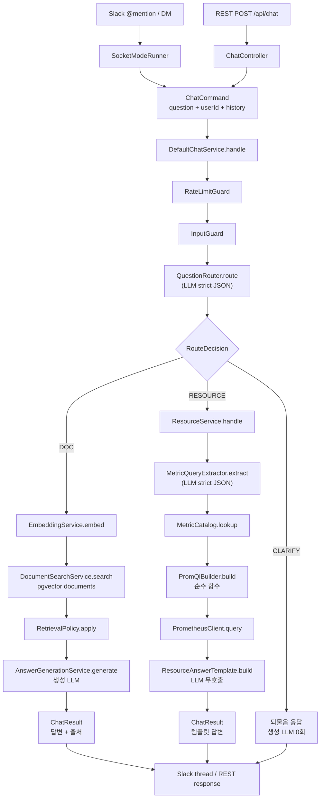
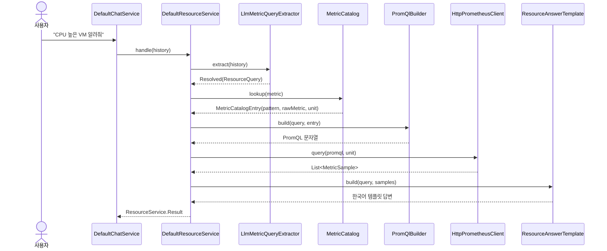
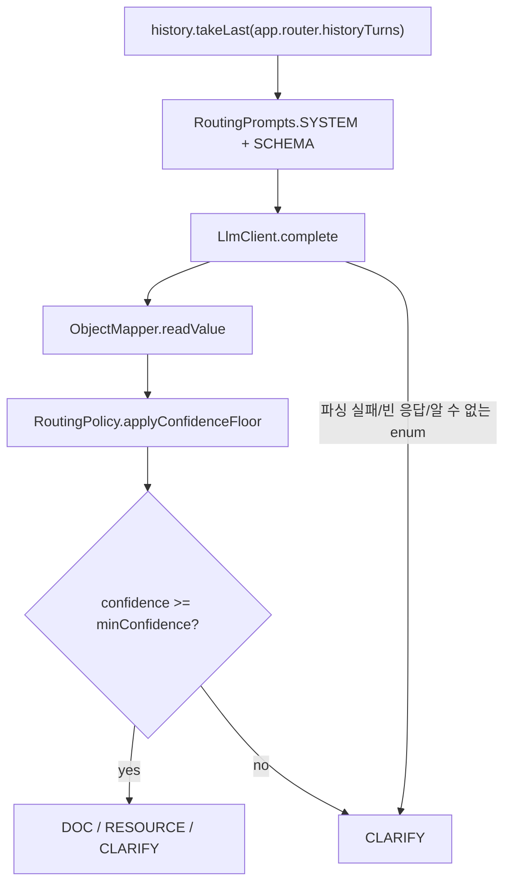
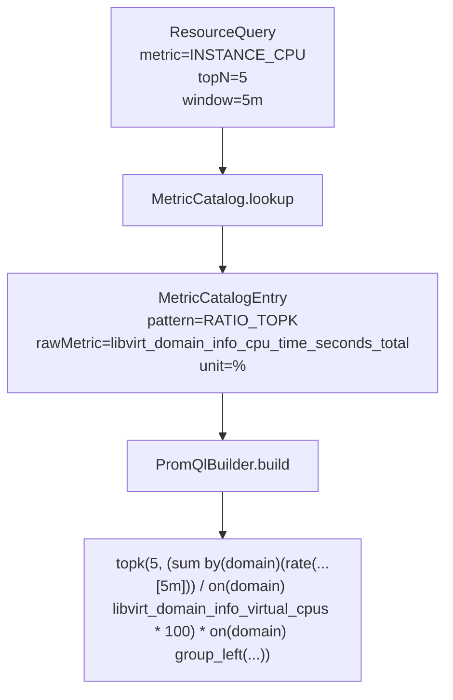
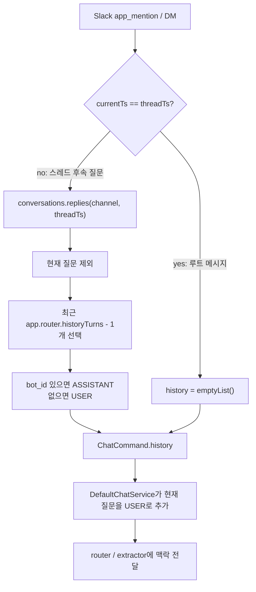

# Phase 2 개발 설명서 — 질문 라우터 + RESOURCE(Prometheus) 경로

> 기준 문서: [`README.md`](../../README.md), [`plan.md`](plan.md)  
> 이 문서는 2차 개발에서 실제로 추가된 구조를 처음 보는 사람이 빠르게 이해하도록 정리한 설명서입니다.

## 1. 한 줄 요약

2차 개발의 핵심은 기존 **문서 RAG 전용 챗봇**을, 질문 종류에 따라 **문서 검색(DOC)** 과
**실시간 인프라 지표 조회(RESOURCE)** 로 나누는 구조로 확장한 것입니다.

사용자 질문이 들어오면 바로 임베딩하거나 생성 LLM을 호출하지 않습니다. 먼저 질문 라우터가
`DOC / RESOURCE / CLARIFY` 중 하나로 분류하고, RESOURCE로 판단된 경우에만 자연어 조건을
`ResourceQuery`로 추출한 뒤 서버가 직접 PromQL을 조립해 Prometheus를 조회합니다.

## 2. 왜 이렇게 만들었나

기존 1차 구조는 "문서에서 근거를 찾고 LLM으로 답변"하는 경로에 집중되어 있었습니다. 하지만
"CPU 높은 VM 알려줘", "메모리 많이 쓰는 인스턴스 3개" 같은 질문은 문서 검색이 아니라 현재
Prometheus 지표를 봐야 합니다.

그래서 2차에서는 다음 목표를 추가했습니다.

- 문서 질문과 지표 질문을 먼저 분류한다.
- LLM이 PromQL을 직접 만들지 못하게 한다.
- Prometheus 지표 답변은 생성 LLM 없이 템플릿으로 만든다.
- Slack 스레드 맥락을 라우터와 조건 추출에 전달해 후속 질문을 처리한다.

이 구조 덕분에 비용이 커지는 생성 LLM 호출은 DOC 경로에서만 발생하고, RESOURCE 경로는
라우팅 1회 + 조건추출 1회 이후 서버 코드와 Prometheus 조회만으로 답합니다.

## 3. 전체 청사진



## 4. 2차에서 추가된 큰 조각

| 영역 | 역할 | 대표 파일 |
|---|---|---|
| 질문 라우터 | 질문을 `DOC / RESOURCE / CLARIFY`로 분류 | `routing/application/LlmQuestionRouter.kt`, `routing/application/RoutingPrompts.kt` |
| 공통 대화 타입 | Slack 스레드 히스토리를 라우터와 RESOURCE 추출기에 전달 | `chat/domain/ConversationMessage.kt`, `chat/application/ChatCommand.kt` |
| RESOURCE 조건추출 | 자연어에서 metric, topN, sort, window, project, instanceName 추출 | `resource/application/LlmMetricQueryExtractor.kt`, `resource/application/ResourcePrompts.kt` |
| 메트릭 카탈로그 | 지원 지표와 실제 Prometheus 메트릭명을 연결 | `resource/application/MetricCatalog.kt`, `application.yml` |
| PromQL 조립 | 카탈로그와 조건을 이용해 서버가 PromQL 생성 | `resource/domain/PromQlBuilder.kt` |
| Prometheus 조회 | `/api/v1/query` 호출, 결과를 `MetricSample`로 변환 | `resource/infrastructure/HttpPrometheusClient.kt` |
| 템플릿 답변 | Prometheus 결과를 한국어 답변으로 포맷 | `resource/application/ResourceAnswerTemplate.kt` |
| 파이프라인 배선 | DOC/RESOURCE/CLARIFY 분기를 실제 서비스에 연결 | `chat/application/DefaultChatService.kt` |
| Slack 히스토리 | 스레드 이전 메시지를 가져와 맥락 후속 질문 지원 | `slack/interfaces/SocketModeRunner.kt` |

## 5. 파일과 함수가 흐르는 그림

```mermaid
flowchart LR
    A["SocketModeRunner.handle<br/>Slack 수신"] --> B["ChatCommand<br/>question/userId/history"]
    C["ChatController<br/>REST 수신"] --> B
    B --> D["DefaultChatService.handle"]

    D --> E["rateLimitGuard.tryAcquire"]
    E --> F["inputGuard.inspect"]
    F --> G["router.route(history + question)"]
    G --> H["LlmQuestionRouter.route"]
    H --> I["LlmClient.complete<br/>OpenAiRouterLlmClient"]
    I --> J{"Route"}

    J -->|DOC| K["DefaultChatService.handleDoc"]
    K --> L["EmbeddingService.embed"]
    L --> M["DocumentSearchService.search"]
    M --> N["RetrievalPolicy.apply"]
    N --> O["AnswerGenerationService.generate"]

    J -->|RESOURCE| P["DefaultChatService.handleResource"]
    P --> Q["DefaultResourceService.handle"]
    Q --> R["LlmMetricQueryExtractor.extract"]
    R --> S["MetricCatalog.lookup"]
    S --> T["PromQlBuilder.build"]
    T --> U["HttpPrometheusClient.query"]
    U --> V["ResourceAnswerTemplate.build"]

    J -->|CLARIFY| W["ChatResult<br/>질문 유형 되물음"]
```



## 6. RESOURCE 내부 흐름



## 7. 라우터가 하는 일

`LlmQuestionRouter.route()`는 최근 대화 히스토리에서 설정된 개수만큼 잘라 LLM에 넘깁니다.
LLM 응답은 자유 텍스트가 아니라 strict JSON 스키마를 따릅니다.



중요한 점은 라우팅이 실패하면 억지로 DOC나 RESOURCE를 타지 않고 `CLARIFY`로 떨어진다는 것입니다.
모호한 질문은 돈을 더 쓰기 전에 사용자에게 되묻습니다.

## 8. 조건 추출기가 하는 일

`LlmMetricQueryExtractor.extract()`는 RESOURCE 질문을 Prometheus 조회 조건으로 바꿉니다.

| 필드 | 예시 | 설명 |
|---|---|---|
| `metric` | `INSTANCE_CPU` | 어떤 지표를 볼지 |
| `sort` | `DESC` / `ASC` | 높은 순 또는 낮은 순 |
| `topN` | `1`, `5`, `10` | 몇 개를 보여줄지, 코드에서 1~20으로 제한 |
| `window` | `5m`, `1h` | rate 계산 기간 |
| `project` | `prod` | 프로젝트 필터 |
| `instanceName` | `web-server-01` | 특정 VM 필터 |

조건 추출도 strict JSON 스키마를 사용합니다. 지표가 불명확하거나 confidence가 낮으면
`ResourceExtraction.NeedsClarification`으로 바뀌고 Prometheus를 조회하지 않습니다.

## 9. PromQL은 LLM이 아니라 서버가 만든다

2차 설계에서 가장 중요한 안전장치는 **LLM이 PromQL을 직접 쓰지 않는 것**입니다.
LLM은 "CPU인지, 메모리인지, 몇 개를 볼지" 같은 조건만 추출합니다. 실제 PromQL은
`MetricCatalog`와 `PromQlBuilder`가 만듭니다.



지원 패턴은 세 가지입니다.

| 패턴 | 쓰는 지표 | 의미 |
|---|---|---|
| `RATIO_TOPK` | CPU | `rate(rawMetric) / vCPU * 100` |
| `GAUGE_TOPK` | Memory | 이미 퍼센트인 게이지 값을 그대로 정렬 |
| `COUNTER_RATE_TOPK` | Network, Disk | counter를 `rate()`로 초당 변화량으로 변환 후 정렬 |

## 10. Slack 스레드 히스토리 흐름

Slack에서는 "1번 상세 알려줘"처럼 앞 답변에 기대는 질문이 자주 나옵니다. 이를 위해
`SocketModeRunner`가 스레드 안의 이전 메시지를 가져와 `ChatCommand.history`에 담습니다.



## 11. 중요한 파일 설명

### `DefaultChatService.kt`

2차 파이프라인의 중앙 분기점입니다. 모든 입력은 결국 여기로 들어옵니다.

1. 사용자별 레이트리밋을 확인합니다.
2. 금칙어와 Moderation 기반 입력 가드를 통과시킵니다.
3. 현재 질문을 히스토리에 붙여 라우터로 보냅니다.
4. 라우팅 결과에 따라 DOC, RESOURCE, CLARIFY 중 하나를 실행합니다.

DOC 경로는 기존 RAG 흐름을 유지합니다. RESOURCE 경로는 `ResourceService`로 넘기고,
CLARIFY는 바로 되물음 답변을 반환합니다.

### `LlmQuestionRouter.kt` / `RoutingPrompts.kt`

질문 유형을 분류하는 모듈입니다. few-shot 예시와 JSON 스키마를 함께 사용해 LLM이 항상
`route`, `confidence`, `reason` 형태로 응답하도록 강제합니다. 파싱 실패나 낮은 confidence는
`CLARIFY`로 안전하게 폴백합니다.

### `LlmMetricQueryExtractor.kt` / `ResourcePrompts.kt`

RESOURCE 질문을 구조화된 `ResourceQuery`로 바꾸는 모듈입니다. "메모리 낮은 순 3개",
"prod 프로젝트 CPU 높은 VM", "web-server-01 메모리" 같은 자연어를 필드 단위 조건으로
정리합니다.

### `MetricCatalog.kt` / `application.yml`

지원 지표 목록과 실제 Prometheus 메트릭명을 연결합니다. 새 지표를 추가할 때는 보통
`MetricPattern`, `application.yml`의 `app.resource.catalog`, 그리고 `ResourcePrompts`의 설명을
함께 맞춰야 합니다.

### `PromQlBuilder.kt`

RESOURCE 경로의 핵심 순수 함수입니다. `ResourceQuery`와 `MetricCatalogEntry`만 받아 PromQL 문자열을
만듭니다. 외부 호출이 없기 때문에 테스트하기 쉽고, LLM 환각으로 없는 메트릭을 조회하는 문제를
막아줍니다.

### `HttpPrometheusClient.kt`

Prometheus HTTP API `/api/v1/query`를 호출합니다. 내부망 자체서명 인증서 환경을 위해
`ssl-verify: false` 설정 시 TLS 검증을 우회할 수 있고, Resilience4j `prometheus` 인스턴스로
Retry와 CircuitBreaker를 적용합니다.

### `ResourceAnswerTemplate.kt`

Prometheus 결과를 한국어 목록 답변으로 바꿉니다. RESOURCE 경로에서는 생성 LLM을 호출하지 않기
때문에 이 파일이 최종 답변 문장을 책임집니다.

### `SocketModeRunner.kt`

Slack 입력을 받는 진입점입니다. 2차에서는 단순 수신뿐 아니라 스레드 히스토리를 조회해
`ConversationMessage` 목록으로 변환하는 역할이 추가되었습니다.

## 12. 실행 예시

질문:

```text
CPU 사용량 높은 VM 5개 알려줘
```

내부 흐름:

```text
QuestionRouter
  -> RESOURCE

MetricQueryExtractor
  -> metric=INSTANCE_CPU, sort=DESC, topN=5, window=5m

MetricCatalog
  -> RATIO_TOPK + libvirt_domain_info_cpu_time_seconds_total + "%"

PromQlBuilder
  -> topk(5, (sum by(domain)(rate(libvirt_domain_info_cpu_time_seconds_total[5m])) / on(domain) libvirt_domain_info_virtual_cpus * 100) * on(domain) group_left(instance_name, project_name) libvirt_domain_openstack_info)

PrometheusClient
  -> MetricSample 목록

ResourceAnswerTemplate
  -> "CPU 사용률이 높은 인스턴스: ..."
```

## 13. 비용과 호출 수

| 경로 | 유료/외부 호출 |
|---|---|
| 입력가드 차단 | 라우터 0회, 임베딩 0회, 생성 0회 |
| CLARIFY | 라우터 1회, 생성 0회 |
| DOC | 라우터 1회, 임베딩 1회, 검색 성공 시 생성 1회 |
| RESOURCE | 라우터 1회, 조건추출 1회, Prometheus 1회, 생성 0회 |

RESOURCE 경로는 답변 생성을 LLM에 맡기지 않기 때문에 비용과 환각 위험을 줄입니다.

## 14. 현재 문서 기준 주의점

`docs/phase2/plan.md` 상단의 인수인계 표에는 R3가 "예정"으로 남아 있지만, 아래 R3/R4 상세와
현재 코드 기준으로는 Prometheus 클라이언트, 템플릿 답변, R4 배선까지 구현되어 있습니다.
실제 현재 상태는 README와 `docs/requirements.md`에 적힌 것처럼 **2차 완료**로 보는 것이 맞습니다.

## 15. 개발자가 다음에 볼 곳

- 전체 동작 개요: [`../../README.md`](../../README.md)
- 요구사항과 완료 상태: [`../requirements.md`](../requirements.md)
- 패키지 구조와 설계 규약: [`../architecture.md`](../architecture.md)
- 2차 단계별 계획과 DoD: [`plan.md`](plan.md)
- 라우터 테스트: `src/test/kotlin/com/okestro/ragbot/routing`
- RESOURCE 테스트: `src/test/kotlin/com/okestro/ragbot/resource`
